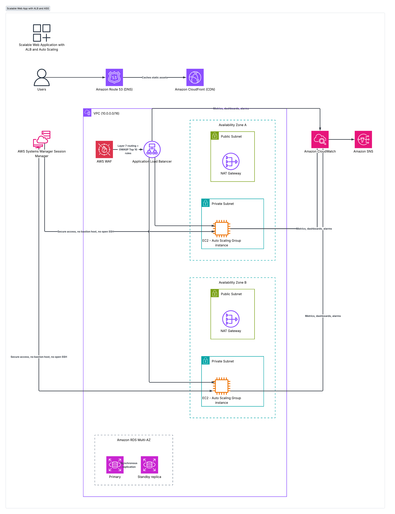

# Scalable Web Application with ALB and Auto Scaling

Production-grade, highly-available web application infrastructure on AWS, built with Terraform. Deploys EC2 instances inside a properly architected VPC across two Availability Zones, fronted by an Application Load Balancer and CloudFront, with a Multi-AZ RDS backend.

## Solution Overview

This project deploys a resilient 3-tier web application architecture:

- A **VPC** with public and private subnets across **2 Availability Zones**, with NAT Gateways for private-subnet internet access.
- An **Application Load Balancer** protected by **AWS WAF** (OWASP Top 10 managed rules), routing traffic to an **Auto Scaling Group** of EC2 instances in private subnets.
- **CloudFront** in front of the ALB for caching and global content delivery.
- A **Multi-AZ RDS** instance (PostgreSQL/MySQL) in isolated private DB subnets, with automated failover.
- **Route 53** for DNS with health checks.
- **Systems Manager Session Manager** for bastion-free, secure access to instances.
- **CloudWatch dashboards and alarms** with **SNS** email notifications.

## Architecture Diagram



Traffic flow: `Users → Route 53 → CloudFront → ALB (+ WAF) → Auto Scaling Group (private subnets, 2 AZs) → RDS Multi-AZ`

## Key AWS Services

| Service | Role |
|---|---|
| VPC | Public & private subnets, NAT Gateway, Security Groups |
| EC2 + ASG | Launch Template, target-tracking scaling policy (CPU 60%) |
| ALB + WAF | Layer 7 routing, health checks, OWASP Top 10 rules |
| CloudFront | Caches responses, reduces latency, single entry point |
| RDS Multi-AZ | PostgreSQL/MySQL with automated failover |
| Route 53 | Alias record to CloudFront, health checks |
| Systems Manager | Session Manager — no bastion host, no open SSH |
| CloudWatch + SNS | Dashboards, CPU/error alarms, email notifications |

## Prerequisites

- [AWS CLI](https://aws.amazon.com/cli/) configured with a profile that has permissions to create the above resources
- [Terraform](https://developer.hashicorp.com/terraform/install) >= 1.5.0
- An AWS account (Free Tier eligible instance types are used by default)

## Project Structure

```
.
├── deployment/
│   ├── run-unit-tests.sh   # terraform fmt + validate
│   └── deploy.sh           # plan / apply / destroy wrapper
├── source/
│   └── infrastructure/     # all Terraform code
│       ├── providers.tf
│       ├── variables.tf
│       ├── vpc.tf
│       ├── security_groups.tf
│       ├── alb.tf
│       ├── asg.tf
│       ├── rds.tf
│       ├── cloudfront.tf
│       ├── route53.tf
│       ├── monitoring.tf
│       ├── outputs.tf
│       └── terraform.tfvars.example
├── architecture-diagram.png
├── CHANGELOG.md
├── LICENSE
└── README.md
```

## Deployment

```bash
git clone <your-repo-url>
cd scalable-web-app-alb-autoscaling

# 1. Configure variables
cp source/infrastructure/terraform.tfvars.example source/infrastructure/terraform.tfvars
# edit terraform.tfvars: set project_name, domain_name (optional), alert_email

# 2. Set the DB master password (never commit this)
export TF_VAR_db_password="YourStrongPassword123!"

# 3. Validate
./deployment/run-unit-tests.sh

# 4. Plan and apply
./deployment/deploy.sh plan  <your-aws-profile>
./deployment/deploy.sh apply <your-aws-profile>
```

After apply finishes, Terraform will output the CloudFront domain name (or your custom domain, if configured) — that's your live application URL.

To tear everything down: `./deployment/deploy.sh destroy <your-aws-profile>`

## Learning Outcomes

- Designing VPCs with correct subnet, route table, and NAT Gateway configurations
- Building highly available architectures across multiple Availability Zones
- Configuring ALB listener rules and target group health checks
- Implementing Auto Scaling with target-tracking policies
- Securing applications with WAF, Security Groups, and private subnets
- Using Systems Manager Session Manager as a bastion-free access alternative

## License

MIT — see [LICENSE](LICENSE).
=======
# scalable-web-app-alb-autoscaling
>>>>>>> cc32da69133820d7ef7f65b349d33969e037ded9
